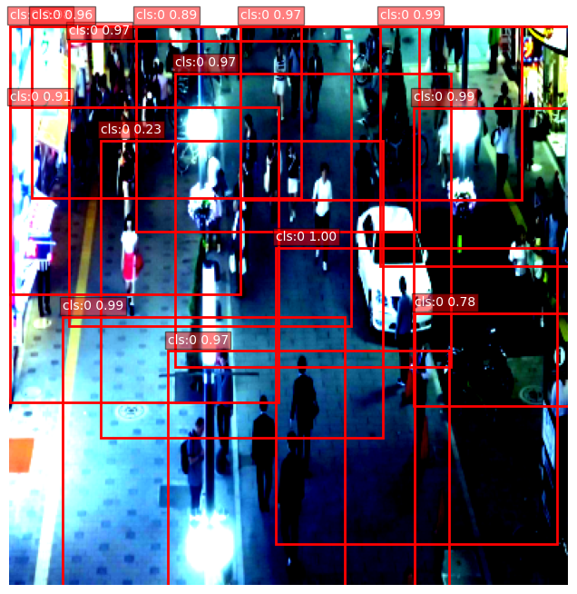

# Ai-PeopleDetection




A lightweight human detection model designed for real-time applications.
SMVIT is a hybrid approach, inspired by YOLO-style detection heads and DETR’s transformer-based architecture.

- ⚡ Ultra-lightweight: model size only ~3MB

- 🎯 Capable of detecting humans in various conditions (day, evening, or night)

- 💻 Runs smoothly on CPU (even low-spec laptops)

- 🔬 Designed from scratch, not just YOLO/ResNet fine-tuning

with this project, you can run Ai by CLI : 
bash 
```
  python -m main
```

suport this project : https://ko-fi.com/alpin92578

tools you need to install:
-------------------------
  - torch
  - torchvision
  - opencv
    
system minimum:
-----------------
- os: windows 10
- Processor: intel core 3 gen 7
- ram: 8gb

model spectification:
-----------------------------
- backbone: Super Micro Vision Transformers
- size: 3mb
- sfesifik task: people detection

credit:
------------------------------
- image processing: opencv 
  link: https://github.com/opencv/opencv
- model trainer and builder: torch
  link : https://pytorch.org/
- datasets by user kaggle: Adil Shamim under license : Attribution-NoDerivatives 4.0 International
  lincese link: https://creativecommons.org/licenses/by-nd/4.0/
  kaggle link: https://www.kaggle.com/datasets/adilshamim8/people-detection

if license or permision at credit has change plases contact me:
email : hinamatsuriairin@gmail.com

  
