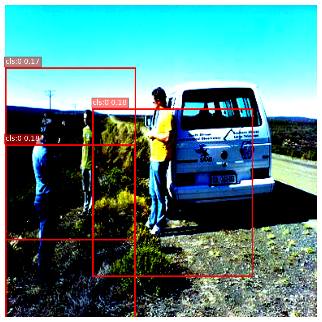

# Ai-PeopleDetection

suport this project : https://ko-fi.com/alpin92578

tools you need to install:
-------------------------
  - torch
  - torchvision
  - opencv
    
system minimum:
-----------------
- os: windows 10
- Processor: intel core 3 gen 7
- ram: 8gb

model spectification:
- backbone: Super Micro Vision Transformers
- size: 3mb
- sfesifik task: people detection
  
